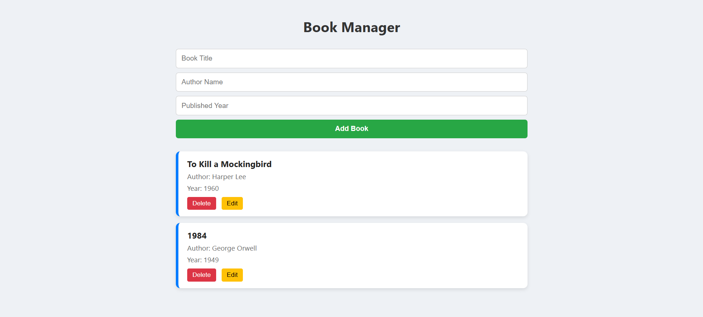
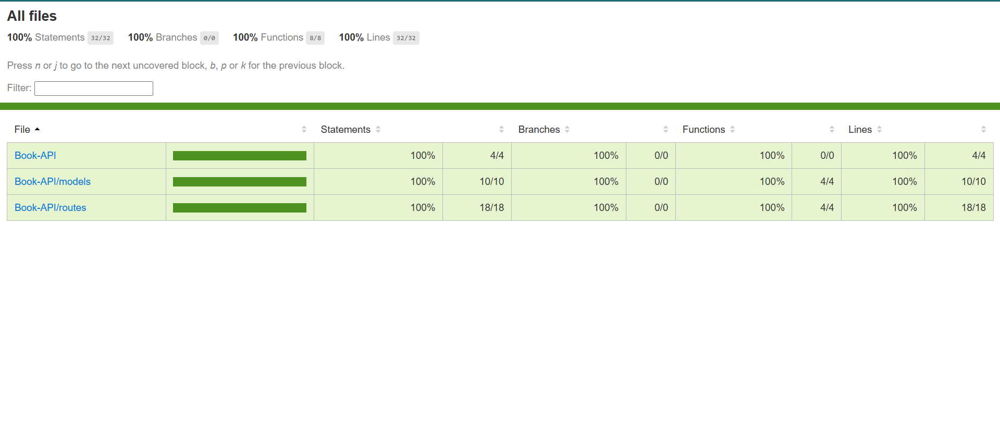

#  Book Manager – Full Stack CRUD App

This project is a beginner-friendly **Book Management System** built using:

- **Backend**: Node.js + Express.js  
- **Database**: MySQL  
- **Frontend**: HTML, CSS, and JavaScript

It allows you to **add**, **view**, **edit**, and **delete** books using a custom REST API and a responsive frontend.

---




##  Features

- Create a new book with title, author, and year
- View all books stored in the database
- Update book details
- Delete books from the list
- Responsive frontend design using plain HTML, CSS & JS

---

## API Endpoints

| Method   | Endpoint           | Description                |
|----------|--------------------|----------------------------|
| `GET`    | `/api/books`       | Fetch all books            |
| `POST`   | `/api/books`       | Add a new book             |
| `PUT`    | `/api/books/:id`   | Update book by ID          |
| `DELETE` | `/api/books/:id`   | Delete book by ID          |

---

## Database Used & Integration

### Database: **MySQL**

A table named `books` is created with the following structure:

```sql
CREATE TABLE books (
  id INT AUTO_INCREMENT PRIMARY KEY,
  title VARCHAR(255),
  author VARCHAR(255),
  year INT
);
```
## Integration in Node.js

We use the `mysql2` Node.js package to connect MySQL to the server.

All connection details are stored securely in a `.env` file like this:

```env
DB_HOST=localhost
DB_USER=root
DB_PASSWORD=your_mysql_password
DB_NAME=bookdb
```

The connection is created in a separate db.js file like this:

```js
js
Copy
Edit
const mysql = require('mysql2');
require('dotenv').config();

const pool = mysql.createPool({
  host: process.env.DB_HOST,
  user: process.env.DB_USER,
  password: process.env.DB_PASSWORD,
  database: process.env.DB_NAME
});

module.exports = pool.promise();
```

## How to Run Your Server
### 1. Clone or Download the Project
**git clone https://github.com/PRINCE-NATH055/Book-API.git**

**cd book-manager**

### 2. Install Dependencies
**npm install**

### 3. Set Up .env File
Create a file named .env in the root directory and add:
```env
DB_HOST=localhost
DB_USER=root
DB_PASSWORD=your_mysql_password
DB_NAME=bookdb
PORT=5000
```

### 4. Start MySQL Server
**Make sure MySQL server is running and the database bookdb exists.**

### 5. Running the Server

**Command** - ```js node server.js```

Backend server should run at:
```https
http://localhost:5000
```

## How to Run the Frontend
**Run the server using the command ```js node server.js```**

Open the browser and go to:
```https
http://localhost:5000
```
We can see the Book Manager app where we can:

- Add a new book

- View all books

- Edit or delete any book

## How to Interact with the API (Sample Requests)
>**We can use tools like Postman or curl.**

>**In my case I used Postman for testing the API by following way**


### We can interact with the API in two ways:

## 1. Using the Front-End

**Run the server using the command ```js node server.js```**

Open the browser and go to:
```https
http://localhost:5000
```
We can see the Book Manager app where we can:

- Add a new book

- View all books

- Edit or delete any book

## 2. Using Postman Software

Before starting, ensure:
- Project is cloned successfully from github and all above steps are performed
- The backend server is running (`http://localhost:5000`)
- The database (`bookdb`) is set up and connected
- Postman is installed

---

###  Create a Book (POST)

**1. Open Postman**  
**2. Set method to `POST`**  
**3. URL: http://localhost:5000/api/books**  


**4. Go to the "Body" tab**  
- Select `raw`
- Choose `JSON` as the content type

**5. Add JSON payload:**
```json

  "title": "The Alchemist",
  "author": "Paulo Coelho",
  "year": 1988
```

**6. Click "Send"**
> **Expected Response**
```js
  "id": 1,
  "title": "The Alchemist",
  "author": "Paulo Coelho",
  "year": 1988
```
---

### Read All Books (GET)

1.Set method to GET**

2.URL: http://localhost:5000/api/books**

3.Click "Send"**
> **Expected Response**
```js
    "id": 1,
    "title": "The Alchemist",
    "author": "Paulo Coelho",
    "year": 1988
```
---

### Update a Book (PUT)

**1. Set method to PUT**

**2. URL: http://localhost:5000/api/books/1**

**3. Go to the "Body" tab**  
- Select `raw`  
- Choose `JSON` format  
- Paste the following data:

```json
  "title": "The Alchemist (Updated)",
  "author": "Paulo Coelho",
  "year": 1993
```

**4. Click "Send"**
> **Expected Response**
```js
"message": "Book updated"
```
---

### Delete a Book (DELETE)
**1. Set method to DELETE**

**2. URL: http://localhost:5000/api/books/1**

**3. Click "Send"**
> **Expected Response**
```js
"message": "Book deleted"
```
---

## Testing and Code Coverage (Latest Task)

To ensure the reliability and correctness of the Book Manager API, I implemented three types of automated tests using **Jest** and **Supertest**:

### Types of Tests Implemented

| Test Type        | Description |
|------------------|-------------|
|  Unit Tests     | Test logic inside `bookModel.js` using both real and mocked database calls |
|  Integration Tests | Test how the Express server interacts with the actual MySQL database |
|  API Tests      | Simulate full API requests and responses using Supertest |

### Tools Used

- [**Jest**](https://jestjs.io/) – for running unit and integration tests and generating code coverage
- [**Supertest**](https://www.npmjs.com/package/supertest) – for testing Express endpoints as real API calls
- [**MySQL2**](https://www.npmjs.com/package/mysql2) – used for DB interaction in non-mocking tests

### How to Run Tests

To execute all tests and generate a coverage report:

```bash
npm test
```


